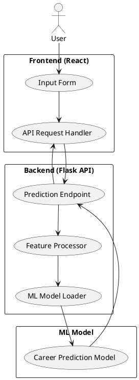
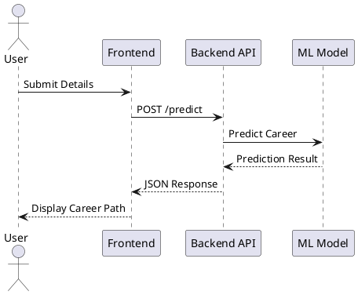
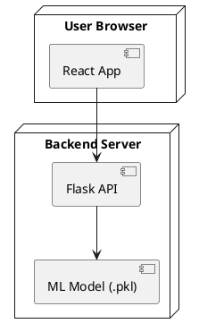

# 🚀 Career Path Recommendation System

---

## 📌 1. Project Vision

This is not just a recommendation tool.

It is an **AI-driven decision support system** designed to analyze user skills, interests, and academic background to suggest optimal career paths using machine learning models.

The system:

* Collects structured user input
* Performs feature preprocessing
* Applies trained ML models
* Generates ranked career recommendations
* Provides actionable insights

In production terms, this is:

> **A machine learning–powered recommendation microservice with an interactive web interface.**

---

# ⚙️ 2. End-to-End System Flow (Real-Time Execution)

### Runtime Workflow

1. User enters academic details, skills, interests
2. Frontend sends structured JSON to backend API
3. Backend preprocesses features
4. ML model predicts career category
5. System ranks recommended career paths
6. Response returned as structured JSON
7. Frontend displays personalized recommendations
8. (Optional) Data stored for analytics & improvement

---

# 🏗 3. High-Level System Architecture


---

### Architecture Layers

---

### 1️⃣ Presentation Layer (Frontend)

* React.js
* Dynamic input forms
* Validation & UX handling
* Result visualization dashboard

---

### 2️⃣ Application Layer (Backend API)

* Flask / Express REST API
* Input validation
* Feature encoding
* Model inference endpoint
* Error handling

---

### 3️⃣ Machine Learning Layer

* Scikit-learn / TensorFlow model
* Trained classifier (e.g., Random Forest / Neural Network)
* Feature scaling & encoding
* Model serialization using Pickle / Joblib

---

### 4️⃣ Data & Infrastructure Layer

* Dataset preprocessing
* Environment variable management
* Logging & analytics
* Deployment configuration

---

# 🧠 4. Machine Learning Pipeline

### Data Processing Flow

1. Dataset collection (skills, academic scores, interests)
2. Data cleaning
3. Feature encoding (Label Encoding / One-Hot Encoding)
4. Feature scaling (StandardScaler)
5. Model training
6. Model evaluation
7. Model serialization

---

## 🔹 Backend Prediction Endpoint Example

```python
@app.route("/predict", methods=["POST"])
def predict():
    data = request.json
    
    features = preprocess(data)
    prediction = model.predict([features])
    
    return jsonify({
        "recommended_career": prediction[0]
    })
```

---

### Internal Backend Steps

* Request parsing
* Feature extraction
* Encoding & scaling
* Model inference
* Probability ranking
* JSON response formatting

---

# 📊 5. Model Selection & Evaluation

Possible Algorithms Used:

* Logistic Regression
* Random Forest Classifier
* Support Vector Machine
* Neural Networks

### Evaluation Metrics

* Accuracy
* Precision
* Recall
* F1-Score
* Confusion Matrix

You should mention actual accuracy if you trained the model.

If you don’t report metrics, it weakens credibility.

---

# 💻 6. Frontend Interaction Logic

```javascript
const handleSubmit = async () => {
  const response = await axios.post("/predict", userData);

  setResult(response.data.recommended_career);
};
```

---

### Frontend Responsibilities

* Validate input fields
* Convert inputs to structured JSON
* Display ranked results
* Handle loading states and errors

---

# 📊 7. System Diagrams

---

## 🏛 7.1 System Architecture Diagram



---

## 🔄 7.2 Sequence Diagram



---

## 🚀 7.3 Deployment Diagram



---

# 📸 8. User Interface Screenshots

(After creating a `screenshots/` folder)

Example:

```markdown
## 📝 Input Form


Users enter academic performance, skills, and interests.

## 📊 Recommendation Result


Displays top recommended career path with confidence score.
```

---

# 🔥 9. Current Limitations

* ❌ Model limited to predefined career categories
* ❌ No real-time job market integration
* ❌ No personalized feedback explanation
* ❌ Limited dataset diversity

---

# 🚀 10. Future Enhancements

* Add real-time job market data (LinkedIn API integration)
* Implement Deep Learning model
* Add Explainable AI (SHAP values)
* Deploy on cloud (AWS / Render)
* Add user authentication & dashboard
* Integrate RAG-based career insights

---

# 🎓 Learning Outcomes

* Machine learning model development
* Feature engineering
* Model evaluation techniques
* REST API integration with ML
* Full-stack ML deployment
* Real-world recommendation system design

---

# 👨‍💻 Author

**Siva Satya Sai Bhagavan Gopalajosyula**
B.Tech – Artificial Intelligence & Data Science


Your move.
